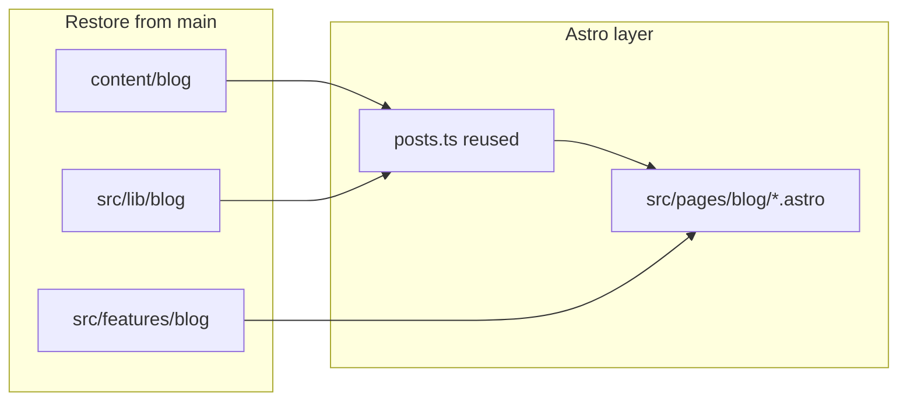

# Sync all blog Markdown from Next.js (`main`) into Astro

## Source of truth

On `**main**`, the blog is:

- **~502 files** under `[content/blog/](content/blog/)` (MD/MDX-style markdown; underscore-prefixed paths are intentionally skipped by the reader).
- **Reader + markdown pipeline:** `[src/lib/blog/posts.ts](src/lib/blog/posts.ts)`, `[src/lib/blog/parse.ts](src/lib/blog/parse.ts)`, `[src/lib/blog/index.ts](src/lib/blog/index.ts)` — uses `**fs` + `path` + `gray-matter` + `reading-time` + `unified`/remark/rehype** to produce HTML and metadata (same as today’s Next behaviour).
- **UI:** `[src/features/blog/](src/features/blog/)` — e.g. `BlogContent` is a static `dangerouslySetInnerHTML` wrapper with Tailwind `prose` classes (no Next-specific APIs).
- **Next routes to mirror:** `[src/app/blog/](src/app/blog/)` (index, `[slug]`, `page/[page]`, `tag/[tag]`, `category/[category]`), plus `[src/app/feed.xml/route.ts](src/app/feed.xml/route.ts)` and blog sections of `[src/app/sitemap.ts](src/app/sitemap.ts)`.

On `**astro`**, blog content and `src/lib/blog` / `src/features/blog` were removed; `[src/pages/feed.xml.ts](/home/amansharma/Desktop/Websites/Gajanan%20Maharaj%20Sansthan/src/pages/feed.xml.ts)` and `[src/pages/sitemap.xml.ts](/home/amansharma/Desktop/Websites/Gajanan%20Maharaj%20Sansthan/src/pages/sitemap.xml.ts)` are stubs without posts.

## Compatibility and structure (subagent audit)

A **readonly Task `explore` subagent** compared `main` to the current `astro` tree.

**Verdict:** The blog is **structurally compatible** with Astro: one stable frontmatter contract, filesystem layout under `content/blog`, and URL rules that map cleanly to `src/pages/blog/*`. **Lowest-risk “exact” parity** is restoring `[src/lib/blog/parse.ts](/home/amansharma/Desktop/Websites/Gajanan%20Maharaj%20Sansthan/src/lib/blog/parse.ts)` unchanged (same unified/remark/rehype stack) rather than re-mapping everything through Astro Content Collections without matching plugins.

**What matches `main` (reuse as-is)**

- **Frontmatter:** Sampled posts use `title`, `description`, `date`, `slug`, `image`, `keywords`, `author`, `tags`, `category`, `locationIds`, `relatedSlugs`.
- **Ingestion:** Only `*.md` under `content/blog`, recursive; skip names starting with `_`; skip `readme.md`; canonical URLs use frontmatter `slug` (with path-derived fallback in code).
- **Pagination:** `BLOG_POSTS_PER_PAGE = 24`; `/blog` = page 1; `/blog/page/n` for `n >= 2`.
- **Taxonomy routes:** `/blog/tag/[tag]` and `/blog/category/[category]` use normalized slugs via `toTaxonomySlug` / `formatTaxonomyLabel` (not raw labels).
- **Body:** Markdown → HTML via `unified`, `remark-gfm`, `rehype-slug`, `rehype-autolink-headings`, `rehype-highlight` (not MDX). Raw HTML in `.md` may pass through (no `rehype-sanitize` on `main`).

**Current `astro` gaps**

- No `content/blog`, `src/lib/blog`, or `src/features/blog` on disk; no `src/pages/blog/*`.
- `[package.json](/home/amansharma/Desktop/Websites/Gajanan%20Maharaj%20Sansthan/package.json)` omits `gray-matter`, `reading-time`, `unified`, and remark/rehype packages that `main` uses.

**Risks**

- **Pipeline drift:** A different markdown pipeline would change heading IDs, autolinks, and code highlighting vs Next.
- **Duplicate `slug`:** `main` throws; Astro should surface the same failure at build time.
- **Assets:** `image: "/images/..."` must resolve like Next (typically `public/`).
- **Downstream:** `relatedSlugs` / `locationIds` need the same helpers and links into existing Astro location pages.

**Subagent in the workflow**

- **Planning:** This audit answers “compatible / same structure?” — yes for data + URLs; implementation must restore the parser (or match it).
- **Post-implementation:** Second **readonly `explore` subagent** (todo `compatibility-subagent`) to re-check counts, taxonomy samples, feed/sitemap, and optional HTML spot-checks.

## SEO regression audit (3 readonly subagents)

Three **Task `explore` (readonly)** passes were run on `**main` vs current `astro`** specifically for crawl/meta/structured-data parity. **Conclusion:** Astro **preserves strong parity for static and location pages**, but the branch **does degrade SEO versus `main` anywhere the blog and sitewide extras touched** — and there is **one non-blog regression** worth fixing even before blog restore.

### Agent 1 — Meta tags, head, JSON-LD

**Preserved on Astro (non-blog):** `[HeadTags.astro](/home/amansharma/Desktop/Websites/Gajanan%20Maharaj%20Sansthan/src/components/seo/HeadTags.astro)`, `[metadata.ts](/home/amansharma/Desktop/Websites/Gajanan%20Maharaj%20Sansthan/src/lib/seo/metadata.ts)`, `lang="en-IN"`, canonical/OG/Twitter patterns, homepage Organization/WebSite/Event in `[index.astro](/home/amansharma/Desktop/Websites/Gajanan%20Maharaj%20Sansthan/src/pages/index.astro)`, location JSON-LD on `[locations/[id].astro](/home/amansharma/Desktop/Websites/Gajanan%20Maharaj%20Sansthan/src/pages/locations/%5Bid%5D.astro)`, OG/twitter/icon routes + extensionless redirects in `[astro.config.mjs](/home/amansharma/Desktop/Websites/Gajanan%20Maharaj%20Sansthan/astro.config.mjs)`.

**Gaps / regressions**

- **No blog routes** → no per-post `generatePageMetadata`-style tags, no `og:type` article, no `**getArticleSchema`** / `**getHowToSchema`** (guides on `main`), no post `**getBreadcrumbSchema`** (helpers still exist in `[structured-data.ts](/home/amansharma/Desktop/Websites/Gajanan%20Maharaj%20Sansthan/src/lib/seo/structured-data.ts)` but unused for posts).
- `**WebSite` `SearchAction` removed:** On `main`, `getWebSiteSchema()` included `potentialAction` (SearchAction → `/blog?q={search_term_string}`). Current Astro `getWebSiteSchema()` omits it — **restore for parity** with `main` once `/blog` exists (or document intentional drop).
- **Deploy env:** `NEXT_PUBLIC_*` → `PUBLIC_*` for site URL and GA; misconfiguration breaks canonicals, OG absolute URLs, and analytics — verify in hosting.
- **Root default keywords:** Next merged layout-level `keywords`; Astro relies on per-page `generatePageMetadata` — ensure no page ships without keywords vs `main`.
- **Fonts:** Google Fonts `<link>` vs `next/font` — indirect (CWV) signal, not a meta-tag loss.

### Agent 2 — Sitemap, robots, RSS, OG assets

**Aligned:** robots allow/disallow/sitemap + Googlebot-Image rules; static + location URLs in sitemap (where listed) match `main` priorities/changefreq pattern; OG/twitter/icon PNG routes + redirects mirror Next extensionless paths.

**Gaps / regressions**

- **Sitemap:** Astro omits **entire blog cluster** (`/blog`, posts, `/blog/page/*`, tag, category). `main` also used **per-post `lastmod`**; Astro currently uses a **single build-day date** for entries — port `main`’s `lastModified` / date logic when expanding sitemap.
- **RSS:** Astro channel is a **stub with no `<item>`s**; `main` listed every post with full fields. Align **channel title/description/language** and `**Content-Type`** with `main` if you want strict parity.
- **Robots `Host:`:** Possible **format mismatch** (hostname-only vs full URL) vs Next-generated `robots.ts` — **diff rendered `robots.txt`** after build.

### Agent 3 — Internal linking, blog discoverability, URL policy

**Gaps on Astro today**

- **Navbar:** no Blog link (`main` had `/blog`).
- **Footer:** no blog hub or deep links to key posts (`main` had both).
- **FeaturedGuides:** static internal links only; `main` used `**getPostsBySlugs`** + `**BlogCard`** for real `/blog/...` equity from the homepage.
- **Breadcrumbs:** booking/location only; no blog listing/post trail.
- `**trailingSlash`:** `never` on Astro vs `false` on Next — **aligned** (no duplicate slash risk). Optional: confirm `**/index.html` → `/`** redirect parity with `main` if external links still use it.

**Implementation must restore** (for SEO parity with `main`): blog routes + listing/tag/category/pagination, per-post schema + breadcrumbs + HowTo for guides, full sitemap + RSS, Navbar/Footer/FeaturedGuides blog links, and `**SearchAction`** on `WebSite` if matching `main`.

### Post-ship verification (todo `seo-subagents-post-verify`)

Re-run **three** focused readonly subagents after implementation to confirm: **(1)** sample pages’ head + JSON-LD match `main` patterns, **(2)** sitemap/RSS/robots/OG outputs match expectations, **(3)** internal graph (nav/footer/home/blog) and breadcrumbs match `main`.

## Implementation strategy

1. **Restore files from `main` (byte-for-byte content + logic)**
  - `git checkout main -- content/blog src/lib/blog src/features/blog`  
  - Optionally restore any `**main`** snippets for “blog in the shell” that were flattened on `astro`: e.g. `[src/components/layout/Navbar.tsx](src/components/layout/Navbar.tsx)` (Blog nav item), `[Footer](src/components/layout/Footer.tsx)`, `[FeaturedGuides](src/features/info/components/FeaturedGuides.tsx)`, `[about](src/pages/about.astro)` / `[locations](src/pages/locations.astro)` guide links, and `[src/lib/seo/structured-data.ts](src/lib/seo/structured-data.ts)` **SearchAction** pointing at `/blog` if you want full SEO parity — merge carefully so you do not revert non-blog Astro fixes (e.g. `next/image` must stay as ``, `PUBLIC_*` env).
2. **Adapt `src/lib/blog` for Astro (small edits only)**
  - Replace `**NEXT_PUBLIC_DEBUG_SEO`** with `**PUBLIC_DEBUG_SEO`** (or `import.meta.env.PUBLIC_DEBUG_SEO`) so optional slug filter matches the Astro env convention already used in `[HeadTags.astro](src/components/seo/HeadTags.astro)`.  
  - Keep `**process.cwd()`** + `**fs`** for build/SSR with `@astrojs/node`; this matches how Next resolved `content/blog` from the repo root.  
  - Ensure **path aliases** (`@/lib/blog`, `@/features/blog`) still resolve in `[tsconfig.json](tsconfig.json)` / Astro.
3. **Add Astro pages (equivalent to Next `app/blog`)**
  - `[src/pages/blog/index.astro](src/pages/blog/index.astro)` — first page (same `POSTS_PER_PAGE` as `main`).  
  - `[src/pages/blog/page/[page].astro](src/pages/blog/page/[page].astro)` — pagination.  
  - `[src/pages/blog/[slug].astro](src/pages/blog/[slug].astro)` — `getStaticPaths` from `getBlogPosts()` (or `getBlogPost`/`notFound` pattern equivalent to Next).  
  - `[src/pages/blog/tag/[tag].astro](src/pages/blog/tag/[tag].astro)` and `[src/pages/blog/category/[category].astro](src/pages/blog/category/[category].astro)`.  
  - Reuse the same layout components as `main` (`BlogListingLayout`, `BlogCard`, `BlogContent`, etc.): render React islands only where interactivity exists; `BlogContent` can be **server-rendered** with no `client:*` (static HTML).
4. **Wire SEO and feeds (close gaps from [SEO regression audit](#seo-regression-audit-3-readonly-subagents))**
  - `**feed.xml`:** Port `main`’s `getBlogPosts()` RSS (`title`, `link`, `description`, `pubDate`, `guid`, `author`, tag categories); align channel title/description/language and `Content-Type` with `main` if strict parity matters.
  - `**sitemap.xml`:** Include `/blog`, every post slug, pagination, tag, and category URLs; port `**lastmod`** per post (or date) as on `main`, not only a single build date for everything.
  - **Post pages:** Match `main` `generateMetadata` via `generatePageMetadata` (`type: "article"`, post image, keywords from post); emit `**getArticleSchema`**, `**getBreadcrumbSchema`** (Home → Blog → post), and for `**category === "guides"**` also `**getHowToSchema**`.
  - `**getWebSiteSchema`:** Restore `**SearchAction`** (`potentialAction` / `/blog?q=…`) to match `main` once `/blog` ships.
  - `**robots.txt`:** Diff built output vs `main` — resolve `**Host:`** line format if crawlers expect consistency.
5. **Dependencies**
  - Merge `package.json` dependencies from `main` required by `[src/lib/blog/parse.ts](src/lib/blog/parse.ts)` and `[src/lib/blog/posts.ts](src/lib/blog/posts.ts)` (e.g. `gray-matter`, `reading-time`, `unified`, remark/rehype packages). Run install and `**npm run build`** / `**npm run lint`**.
6. **Verification**
  - Post count: `getBlogPosts().length` matches `main` (order may differ if sort keys match).  
  - Spot-check slugs for HTML, tags, categories, pagination; confirm taxonomy URLs use `toTaxonomySlug`.  
  - Confirm `/feed.xml` and sitemap include blog entries and match `main` URL set + freshness fields where applicable.  
  - **Subagents:** todo `compatibility-subagent` (content/pipeline); todo `seo-subagents-post-verify` (**3** readonly passes: meta/JSON-LD, crawl surfaces, internal links/breadcrumbs).

## Risk / notes

- **Scale:** Hundreds of posts — `getStaticPaths` for `[slug]` is expected; build time will increase (same order as Next SSG).  
- **FeaturedGuides / hardcoded slugs:** If `main` used `getPostsBySlugs`, restore that in Astro frontmatter or a small server helper so the home/about blocks stay in sync with real posts.

No separate “sync script” is required if you use `**git checkout main -- content/blog`**; that keeps Markdown **identical** to the Next version.